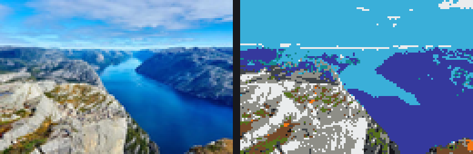

# WooliPic · 羊毛画生成器

把我的世界（Java 版）里选一张本地图片，用 **16 色羊毛**按人眼感知最接近的颜色，
在世界中逐格搭出来。

* **MC 版本**：1.21.4
* **加载器**：Forge 54.1.18
* **类型**：客户端模组（`clientSideOnly = true`）
* **作者**：mrding

---

## 效果



左：原图 ｜ 右：128 方块宽的实际效果（逐块平均色差 ΔE 11.35，8×8 局部色调 ΔE 7.19）

---

## 功能

* 游戏内界面，通过**系统文件选择框**选任意本地图片（PNG / JPG / BMP / GIF）
* **实时预览**：左边并排显示「原图 / 羊毛效果」，改任何参数立刻重算
* 可调：宽度（方块数）、高度自动或手动、居中裁剪、旋转、水平翻转、对比度增强
* **色彩匹配用 CIEDE2000 色差公式**（CIE Lab 感知均匀空间），而不是简单 RGB 距离
* 可限制只使用部分羊毛颜色（做复古 / 低饱和风格）
* 摆放位置按你**当前视线方向**自动计算，画面立在你面前
* 相同颜色的连续方块合并成 `/fill` 指令，128×85 的画面只需几百条而不是一万条
* 可选行为包 / 结构文件导出（配套的 Python 工具，见下方"相关项目"）

### 色彩匹配为什么重要

RGB 空间不是感知均匀的——两个 RGB 距离相同的颜色对，人眼看到的差别可能相差数倍。
在只有 16 色的极端约束下，用 RGB 距离经常把深蓝匹配成品红、橙色匹配成棕色。

本项目用 CIEDE2000，实现已用 **Sharma 等人的 34 组官方测试数据**核对，
模组启动时会自动跑一遍自检并写进日志：

```
[woolipic/]: CIEDE2000 自检通过（对照 34 组标准数据，最大偏差 4.9498977271467126E-5）
```

---

## 安装

### 1. 编译（或下载 Release 里的 jar）

需要三个 JDK —— 这是 **ForgeGradle 7 的硬性要求**，不是配置错误：

| JDK | 用途 |
|---|---|
| **JDK 21** | 构建用，Minecraft 1.21.4 的编译目标 |
| **JDK 25** | ForgeGradle 7 内部 `mavenizer` 工具的运行环境 |
| **JDK 8** | 处理 Mojang 官方 mappings（`srg2names`） |

外加 **Gradle 9.3.1**（ForgeGradle 7 要求 ≥ 9.3.0，用 8.x 会被直接拒绝）。
`settings.gradle` 里配了 `foojay-resolver`，缺失的 JDK 会由 Gradle 自动下载。

Windows 上直接双击 **`build.bat`**；它会自动找 JDK、清理上次失败的残留，
然后编译并在 `build\libs\` 产出 jar。

手动构建：

```powershell
$env:JAVA_HOME   = "<你的 JDK 21>"
$env:JAVA_HOME_8 = "<你的 JDK 8>"
.\gradlew.bat "-Porg.gradle.java.installations.paths=<JDK21>,<JDK8>,<JDK25>" build
```

### 2. 装进游戏

把 `build\libs\woolipic-1.0.0.jar` 放进 mods 目录：

* **没有开版本隔离**：`%APPDATA%\.minecraft\mods\`
* **开了版本隔离**（PCL2 / HMCL 常见选项）：`.minecraft\versions\<版本名>\mods\`

`安装.bat` 会自动探测这两种情况并复制、校验。

### 3. 使用

进存档（**需要作弊开启**，因为放置依赖指令），然后：

```
/woolipic
```

界面打开 → 点「浏览本地图片…」选图 → 调尺寸 → 点「▶ 开始放置」。

命令行方式：

```
/woolipic load <图片完整路径>
/woolipic info
/woolipic build [距离]
/woolipic cancel
```

---

## 指令

| 指令 | 说明 |
|---|---|
| `/woolipic` | 打开图形界面 |
| `/woolipic load <路径>` | 用当前设置转换指定图片（不改界面参数） |
| `/woolipic info` | 打印当前图的尺寸、色差、用色统计 |
| `/woolipic build [距离]` | 在你面前放置，距离默认 3 格 |
| `/woolipic cancel` | 取消还没发完的放置指令 |

---

## 工作原理

```
图片文件
  │  ImageIO 读取
  ▼
BufferedImage ──旋转/翻转/裁剪/缩放（双三次）──► 方块尺寸的缩略图
  │  逐像素
  ▼
CIEDE2000 匹配最近羊毛 ──► woolIndex[y][x]（16 色索引）
  │
  ├─► 预览图（羊毛色渲染，界面显示）
  └─► 按行合并成 /fill 指令 ──► 逐 tick 发送给服务端
```

### 为什么用指令而不是直接改世界

模组装在客户端，而方块数据在服务端（单人游戏也是"客户端 + 内置服务端"）。
客户端能可靠影响世界的手段就是发指令，好处是自带权限校验，
也不会因为版本差异导致数据不同步。

### 性能

* 颜色匹配用 5 位 RGB 缓存表（32768 个格子），避免每个像素都算一次 CIEDE2000
* 指令按行合并：128×85 的图通常几百条 `/fill`，按默认 4 条/tick 约十几秒放完
* 图片读取和转换放在后台线程，界面不阻塞

---

## 项目结构

```
woolipic/
├── build.bat                 双击编译
├── 安装.bat                  双击安装到 mods 目录
├── 构建说明.md               详细构建/排错说明
├── palette_wool.json         16 色羊毛的官方贴图平均色
├── src/main/java/com/woolipic/
│   ├── WooliPic.java         主类、指令注册、客户端事件、启动自检
│   ├── WooliPicScreen.java   游戏内界面（选图/预览/参数/放置）
│   ├── WoolImage.java        图片加载、缩放、量化、质量指标
│   ├── WoolPalette.java      16 色羊毛表 + 最近色匹配缓存
│   ├── ColorMath.java        CIE Lab 转换 + CIEDE2000（含官方数据自检）
│   ├── Builder.java          放置计算与 /fill 指令生成、逐 tick 发送
│   └── Config.java           设置持久化、图片副本管理
└── src/main/resources/META-INF/mods.toml
```

---

## 关于羊毛颜色的取值

`WoolPalette` 里的 16 个 RGB 值取自 **Mojang 官方资源包贴图**
`wool_colored_<name>.png` 的平均色——不能凭肉眼估，官方贴图带细微噪点和明暗变化，
直接用"标准染料色"会有可见偏差。

注意 **Java 版与基岩版的方块 ID 有差异**，代码里贴图名和方块 ID 是分开的字段：

| 贴图名 | 基岩版 ID | Java 版 ID |
|---|---|---|
| silver | `silver_wool` | **`light_gray_wool`** |

其余 15 种两版一致。写错会直接导致 `/fill` 报"未知的方块类型"。

---

## 已知限制

* **只能在电脑上生成**：界面用的是 AWT 系统文件对话框，需要桌面环境
* **需要作弊/OP**：放置靠 `/fill` 指令，单机开作弊即可，服务器需要 OP
* **方块数上限**：建议不超过 256×256。再大触发指令过多，游戏会明显卡顿
* **16 色覆盖有限**：高饱和的青绿/品红区域色差最大（实测约 ΔE 34），
  肤色/天空/岩石/植被表现很好
* **目前不支持抖动**：16 色羊毛下实测任何抖动都会明显加噪点
  （误差扩散把逐像素色差从 12.1 推到 23.8），所以没有实现

---

## 相关项目

同一套调色板和色差算法还有一个**基岩版**版本：用 Python 把图片转成
`.mcstructure` 结构文件，在游戏里用结构方块放置，支持分块、Java 版数据包导出。

## 许可

MIT
